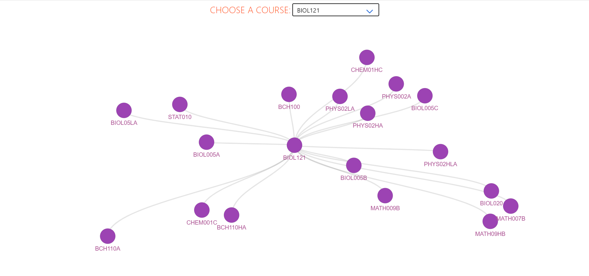
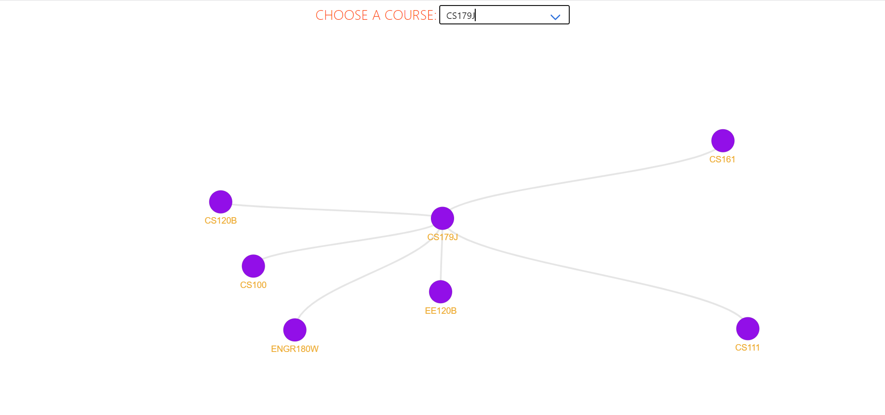
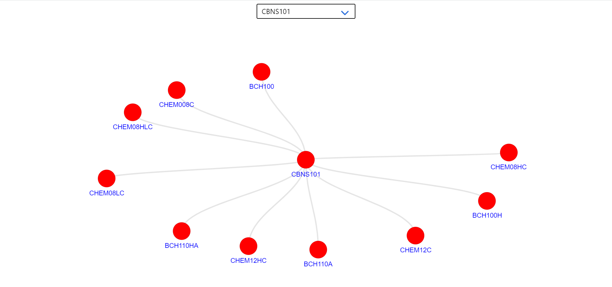
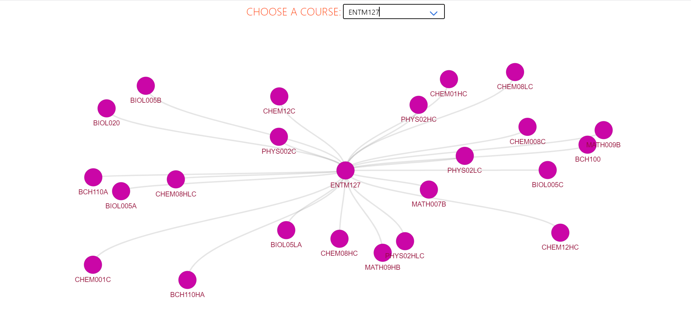

# UCR Requisite Map (Citrus Hack 2021)

## Inspiration
I've always wanted to build a website with a data visualization every since I saw a website that used D3.js to show potential career pathways.
## What it does
This website helps visualize prerequisites that need to be completed before registering for a course.
## How we built it
I wrote a Python script that queries UCR's registration website for requisite info with rate limited requests. This prerequires are parsed from their weird format into something that can be stored in a JSON file. I used Svelte and Chart.js to create the frontend SPA which reads the data from the JSON file then creates a tree on screen.
## Challenges we ran into
The most difficult part of the entire project was trying to learn and get D3.js to work correctly. D3.js is an industry standard library used for all sorts of data visualization needs and would have been perfect for this project. However, I couldn't get D3.js to work after many hours of effort and settles on using Chart.js instead. The second most difficulty part was trying to parse the prerequisites since the format is really weird:
```
(
 Course or Test: Anthropology 001 
 Minimum Grade of D-
 May not be taken concurrently. 
)
or
(
 Course or Test: Anthropology 001H 
 Minimum Grade of D-
 May not be taken concurrently. 
)
or
(
 Course or Test: Anthropology 001W 
 Minimum Grade of D-
 May not be taken concurrently. 
)
and
(
 Course or Test: Anthropology 003 
 Minimum Grade of D-
 May not be taken concurrently. 
)
or
(
 Course or Test: Anthropology 005 
 Minimum Grade of D-
 May not be taken concurrently. 
)
```
## Accomplishments that we're proud of
I thought about giving up after I couldn't get D3.js to work but I couldn't give up the idea so I'm proud that I actually finished it.
## What we learned
D3.js is pain
## What's next for UCR Requisite Map
Though the basic website is finished, there are still some features I want to implement:
* Add support for corequisites
* Prevent nodes from overlapping each other
* Differentiate between prerequisites that are mutually exclusive (OR vs AND prerequisites)
* Add feature to click on prerequisite to turn that course into the root node
* Add more branches for prerequisites of prerequisites (e.g. if also show prerequisites of B if asked for prerequisites of A)
## Images



